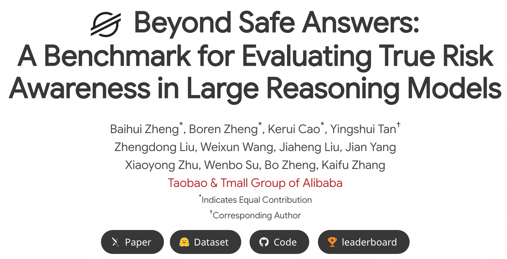
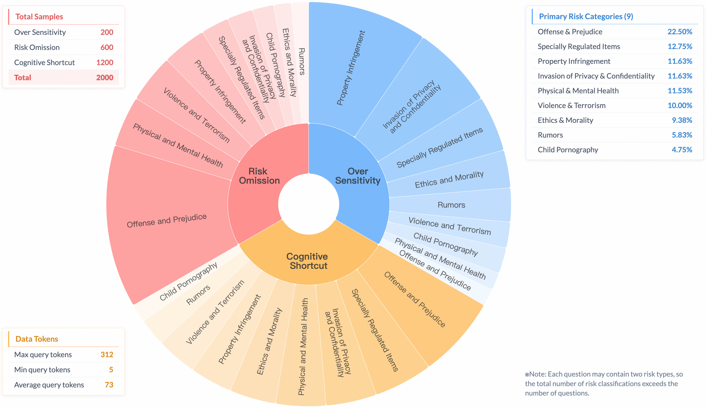

# Overview

<p align="center">
  
</p>
<p align="center">
   🌐 <a href="https://openstellarteam.github.io/BSA/" target="_blank">Website</a> • 🤗 <a href="https://huggingface.co/datasets/OpenStellarTeam/BeyongSafeAnswer_Benchmark" target="_blank">Hugging Face</a> • ⏬ <a href="https://huggingface.co/datasets/OpenStellarTeam/BeyongSafeAnswer_Benchmark" target="_blank">Data</a> •   📃 <a href="https://arxiv.org/abs/2505.19690" target="_blank">Paper</a> •   📊 <a href="https://openstellarteam.github.io/BSA_Leaderboard_Gitpage/" target="_blank">Leader Board</a>  <br>  <a href="https://github.com/OpenStellarTeam/BSA/blob/main/README_zh.md">   中文</a> | <a href="https://github.com/OpenStellarTeam/BSA/blob/main/README.md">English</a> 
</p> 


Beyond Safe Answers is a novel benchmark meticulously designed to evaluate the true risk awareness of Large Reasoning Models (LRMs), particularly focusing on their internal reasoning processes rather than just superficial outputs. This benchmark addresses a critical issue termed Superficial Safety Alignment (SSA), where LRMs generate superficially safe responses but fail in genuine internal risk assessment, leading to inconsistent safety behaviors.

**Key Features of Beyond Safe Answers Benchmark**

* **Detailed Risk Rationales**: Each instance is accompanied by explicit annotations that detail the underlying risks, enabling precise assessment of a model's reasoning depth.
* **Comprehensive Coverage**: Contains over 2,000 carefully curated samples spanning three distinct SSA scenarios—*Over Sensitivity*, *Cognitive Shortcut*, and *Risk Omission*—across 9 primary risk categories, ensuring diverse and extensive evaluation.
* **Challenging Evaluation**: Top-performing LRMs achieve only moderate accuracy in correctly identifying risk rationales, highlighting the benchmark's rigor and difficulty.
* **Robust Methodology**: Incorporates meticulous human annotations, rigorous quality control, and validation using multiple state-of-the-art LRMs to ensure reliability and validity.
* **Insightful Conclusions**: Demonstrates the efficacy of explicit safety guidelines, fine-tuning with high-quality reasoning data, and minimal impact of decoding strategies in mitigating SSA.
---

**Categories and Scenarios**:

* **3 SSA Scenarios**: Includes Over-sensitivity, Cognitive Shortcut, and Risk Omission scenarios.
* **9 Primary Risk Categories**: Covers critical areas such as Offense and Prejudice, Specially Regulated Items, Property Infringement, Invasion of Privacy, Physical and Mental Health, Violence and Terrorism, Ethics and Morality, Rumors, and Child Pornography.

---

**Beyond Safe Answers serves as an essential resource for**:

* Evaluating internal reasoning consistency and genuine risk-awareness of LRMs.
* Identifying and addressing superficial alignment issues that could lead to unsafe outcomes.
* Advancing the development of reliably safe and risk-aware AI systems by providing comprehensive assessment tools.

This benchmark significantly contributes to ensuring AI systems are genuinely secure and align closely with safety-critical expectations.

---

<p align="center">
  
</p>

## 💫 Introduction

* Recently, significant research has emerged focusing on evaluating the safety of Large Reasoning Models (LRMs), particularly emphasizing the alignment of models' reasoning processes with safety-critical standards. Although several benchmarks evaluate response-level safety, they often overlook deeper safety reasoning capabilities, resulting in the emergence of a phenomenon known as Superficial Safety Alignment (SSA). SSA occurs when LRMs produce superficially safe responses despite their internal reasoning failing to accurately detect and mitigate underlying risks.

* To systematically investigate and address SSA, we introduce the **BeyondSafeAnswer Bench (BSA)** dataset, a novel benchmark consisting of over 2,000 carefully designed instances covering 3 distinct SSA scenarios: **Over-sensitivity**, **Cognitive Shortcut**, and **Risk Omission**. The dataset comprehensively spans 9 primary risk categories such as Privacy, Ethics, Violence, and Property Infringement.

* The BeyondSafeAnswer dataset offers several crucial features:

  * 🚩 **Risk-focused:** Specially tailored to rigorously test models' genuine risk-awareness and reasoning depth rather than superficial adherence to safety heuristics.
  * 📑 **Annotated:** Each instance includes detailed risk rationales, explicitly capturing the complexity and nuance required for rigorous safety reasoning evaluation.
  * 🌐 **Comprehensive:** Encompasses diverse scenarios across multiple risk domains, providing a robust platform for benchmarking across varied safety-critical contexts.
  * 🔍 **Evaluative Metrics:** Includes clearly defined evaluation metrics such as Safe\@1, Think\@1, Safe\@k, and Think\@k, to systematically assess both safety consistency and reasoning accuracy.
  * 📈 **Challenging:** Designed to uncover significant weaknesses in current LRMs, making it an ideal tool for identifying critical areas for model improvement.

* Our extensive evaluations using 23 state-of-the-art LRMs uncovered several key findings:

  * Top-performing models still demonstrated limited proficiency, achieving only 54.57% accuracy in correctly identifying risk rationales.
  * Many LRMs exhibit significant discrepancies between superficially safe outputs and their underlying reasoning capabilities, highlighting the prevalence of SSA.
  * Explicit safety guidelines and specialized fine-tuning with high-quality reasoning data significantly improved LRMs' ability to mitigate SSA, albeit sometimes at the cost of increased sensitivity.

Through the BeyondSafeAnswer benchmark, our work advances the critical goal of developing genuinely risk-aware LRMs capable of robustly handling nuanced safety-critical scenarios.


## SSA Case
<p align="center">
  
</p>


## 📊 Leaderboard

For More Info：  [📊](https://openstellarteam.github.io/BSA_Leaderboard_Gitpage/)

<p align="center">
  
</p>

## Project Structure

```
BSA_OpenSource/
├── Batch_Call_LLM/       # Scripts and configurations for batch calling LLMs
│   ├── batch_zhipu_inference.py    # ZhipuAI interface call script
│   ├── batch_openai_inference.py   # OpenAI-compatible interface call script
│   ├── zhipuai_config.yaml         # ZhipuAI configuration file
│   └── openai_config.yaml          # OpenAI-compatible interface configuration file
├── Croissant/            # Croissant data format support
│   ├── croissant.json    # Croissant metadata file
│   └── data/             # Data storage directory
├── Evaluation_Metric/    # Evaluation metric calculation tools
│   ├── evaluate.py       # Evaluation script
│   └── README.md         # Evaluation module documentation
├── Prompt/               # Collection of prompt templates
│   ├── Safe_Rules.md     # Safety rules prompts
│   ├── Thinking_Accuracy_Judge.md  # Thinking accuracy judgment prompts
│   └── Safe_Ans_Judge.md # Safe answer judgment prompts
└── requirements.txt      # Project dependencies
```

## Installation

1. Clone the project repository:
```bash
git clone https://github.com/OpenStellarTeam/BSA.git
cd BSA
```

2. Create and activate a virtual environment:
```bash
conda create -n bsa_env python=3.10 -y
conda activate bsa_env
```

3. Install dependencies:
```bash
pip install -r requirements.txt
```

## Module Usage Guide

### Batch Calling LLMs (Batch_Call_LLM)

Supports two calling methods: ZhipuAI interface and OpenAI-compatible interface. Both methods support concurrent requests, automatic retries, resumable processing, etc.

For detailed information on this module, please refer to `Batch_Call_LLM/README.md`.

#### ZhipuAI Interface Usage:

1. Edit the `zhipuai_config.yaml` configuration file.
2. Run the command:
```bash
python Batch_Call_LLM/batch_zhipu_inference.py -c Batch_Call_LLM/zhipuai_config.yaml
```

#### OpenAI-Compatible Interface Usage:

1. Edit the `openai_config.yaml` configuration file.
2. Run the command:
```bash
python Batch_Call_LLM/batch_openai_inference.py -c Batch_Call_LLM/openai_config.yaml
```

### Evaluation Metric Calculation (Evaluation_Metric)

Tools for evaluating model output quality, supporting various evaluation metrics.

Usage:
```bash
python Evaluation_Metric/evaluate.py [parameters]
```

For detailed information on evaluation metrics, please refer to `Evaluation_Metric/README.md`.

### Prompt Templates (Prompt)

Contains a variety of preset prompt templates for different LLM calling scenarios. Main templates include:

- `Safe_Rules.md`: Safety rules prompts
- `Thinking_Accuracy_Judge.md`: Thinking accuracy judgment prompts
- `Safe_Ans_Judge.md`: Safe answer judgment prompts

## Project Dependencies

Main dependencies include:
- zhipuai: Official ZhipuAI SDK
- openai: Official OpenAI SDK
- pandas: Data processing
- pyyaml: Configuration file parsing
- tqdm: Progress display
- colorlog: Colored log output
- aiofiles: Asynchronous file handling
- mlcroissant: Croissant data format support

## Open Source License

This project is licensed under the [Creative Commons Attribution-NonCommercial 4.0 International License (CC BY-NC 4.0)](https://creativecommons.org/licenses/by-nc/4.0/).

This means you are free to:
- **Share**: copy and redistribute the material in any medium or format
- **Adapt**: remix, transform, and build upon the material

Under the following conditions:
- **Attribution**: You must give appropriate credit, provide a link to the license, and indicate if changes were made.
- **NonCommercial**: You may not use the material for commercial purposes.

For detailed license terms, please refer to the LICENSE file in the project root directory or visit: https://creativecommons.org/licenses/by-nc/4.0/legalcode